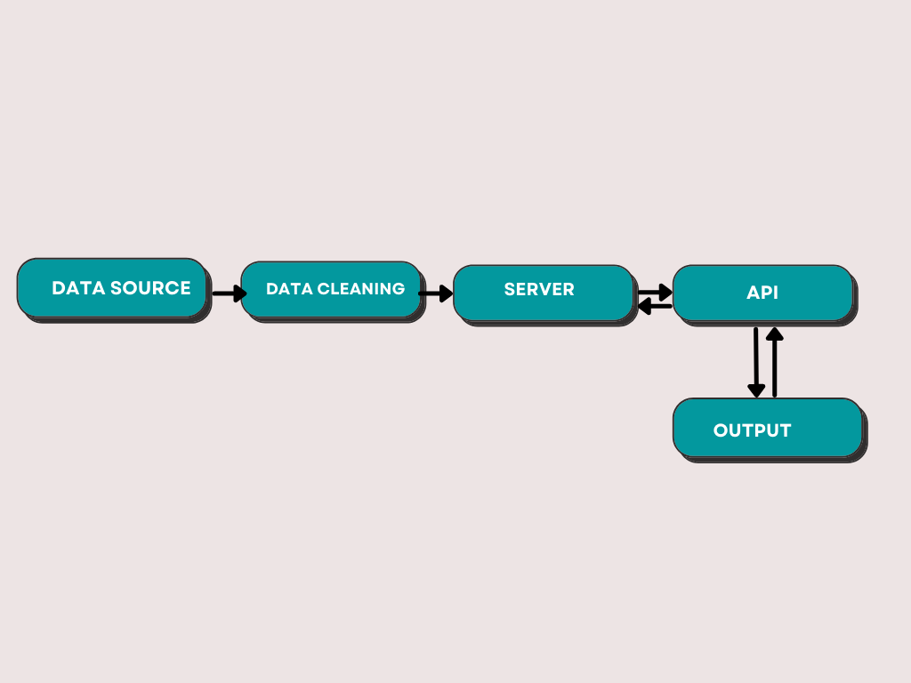

# TM Data Engineer Exam Deliverables

This is the repository for my coding exam at Thinking Machines. The first part includes a brute-force implementation of an algorithm to find coefficients of a given equation which gives the most consecutive number of primes. I used Python to implement the algorithm. The second part consists of cleaning a dataset, loading it into a database, and creating a web service that provides information pertaining to a unique user. I used the pandas and numpy module in Python for the data cleaning process. For the web service, I set up a project using ASP.NET and C#.

## Part 1 - Algorithmic Thinking.py 
This contains the solution for the first problem, and outputs the equation and product of coefficients being asked. 

## Part 2.1 - Soft(ware) Skills.ipynb 
This notebook shows the data cleaning process for the second part. These were the procedures I implemented to clean the data:
- Null values were dropped because there were only 5 NaN values, which are relatively small compared to the original 20,500 rows of data.
- Duplicates were also dropped. The rows with the same values for user, timestamp, and project had their 'hours' aggregated and summed. Duplicates were then also dropped. 
- Erroneous months (in Russian) were converted to its English equivalent, and afterwards, the timestamps were curated to be uniform. 
- Date outliers were removed. 
- Outliers in hours were also taken care of. 

## Part 2.2 - Web Service
The resulting .csv file from the data cleaning process was loaded into Microsoft SQL Server.

A web service using ASP.NET and C# was done, but could only output all users' data because I had difficulties in making the SQL query inside the code work. I tried tweaking the syntax but sometimes they output null and sometimes just an empty space. I wasn't able to verify which part of the code doesn't work with the given SQL query string.

## Answers to Questions 
**Q1.** If the data is to ingested periodically, what changes will you make to your current approach?

**A1.** If the data is to ingested periodically, I would perhaps create a cloud function that I could schedule to run periodically. Additionally, I would create an ETL pipeline and adjust its cron schedule to run periodically as well. 

**Q2.** Draw a data architecture showing different components of your ETL process.

**A2.** The data source passes the raw data to the data cleaning module/process. The cleaned data is then loaded to a database, which is connected to the API. The output devices connect to the API and communicates the data it wants to receive. 

**Q3.** How will you verify the correctness of the ingested data?

**A3.** I could write queries to manually verify whether data is coherent. I could also do comparisons to the output data and the raw data to check if the data has been processed and passed correctly.
